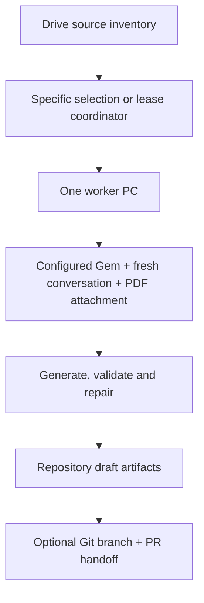

# Automated learning-content generator

This Python 3.12 package turns one controlled Google Drive `source.pdf` into one repository-compatible subchapter draft. It supports a safe specific-subchapter run and a distributed mode in which several Windows PCs claim different PDFs from the same Drive tree.

For the complete beginner-facing workflow from controlled PDF → generated draft → human review → static review bundle → optional GitHub Pages deployment, use `docs/PDF_TO_APP_QUICKSTART.md`.

This document is the technical generator reference. Project recycling details live in `docs/GENERIC_PROJECT_SETUP.md`; workstation internals live in `docs/WORKSTATION_SYNC.md`; configuration fields live in `config/README.md`.

The generator never adds a source PDF, OAuth credential, browser profile, coordinator token, or raw Gemini response transcript to Git. Generated content remains `draft` until the repository's qualified human reviews are complete.

## Implemented architecture



Python owns stable IDs, staged generation, strict JSON parsing, deterministic schema/content validation, targeted repair, file writing, tests, and optional Git/PR handoff. Gemini supplies source-bounded content generation inside a fresh conversation for each controlled PDF.

## Current project authority

The normal tracked project authority on `main` is:

```text
config/configure_project.toml
```

The project-specific Gem text is also tracked under `config/`:

```text
config/gem_description.txt
config/gem_instructions.md
```

Machine-local material is rendered into ignored `project.local.toml` by `sync-workstation.cmd`; OAuth files, Chrome profile, run state, tokens, and PDFs remain outside Git.

`config/project.toml` exists only as a compatibility file during the current migration and is not the normal user-facing authority selected by `sync-workstation.cmd`.

## Source identity and job selection

The Drive scanner recursively finds files matching:

```text
.../<subchapter-id>/source.pdf
```

The immediate parent directory must look like `8.1`. Ancestor folder names are project-defined. Jobs are sorted numerically by chapter and subchapter. A job identity combines the stable Drive file ID with the available Drive version/MD5/modified-time identity, so replacing a PDF creates a new source version.

The run templates in `config/configure_project.toml` materialize values such as `{chapter_number}`, `{subchapter_id}`, `{section_slug}`, and `{source_id_prefix}` after a PDF is resolved or claimed. Validated source analysis supplies the printed section title and effective scope used in the final package metadata.

Two selection modes are supported:

| Mode | Purpose |
|---|---|
| `specific` | Controlled run for an explicit subchapter such as `8.5`; no central claim is made. |
| `distributed` | Discover all eligible sources and atomically claim the next available job through the coordinator. |

The current source-manifest contract represents exactly one controlled source file, so one package is generated from one PDF.

## Gemini configuration and live behavior

Before a live generation, the client reads the authoritative Gem values from the repository:

- Name from `config/configure_project.toml` (`gemini.gem_name`);
- Description from `config/gem_description.txt`;
- Instructions from `config/gem_instructions.md`.

The Gem editor is opened under the configured Google account. The generator compares the editable fields, replaces only values that differ, saves once when necessary, reopens the editor, and verifies persistence before continuing. If all values already match, no Save/Update is issued.

The live conversation flow then:

1. opens a fresh Gem conversation;
2. discovers visible model choices when Gemini exposes a model picker;
3. ranks/selects the configured preferred model when possible;
4. falls back to the Gem's current/default model only when policy allows and the picker is unavailable;
5. attaches exactly one verified local copy of the controlled PDF;
6. submits staged machine-readable generation and repair prompts.

Gem Knowledge is not part of the generation workflow. The browser uses a dedicated persistent Chrome profile. An ordinary user-opened Chrome tab is not silently adopted.

Gemini has no stable public web-UI automation contract. Accessible selectors are centralized in the Gemini browser code, and controlled live validation remains necessary after substantial Gemini UI changes.

## Generated artifacts and review status

For a generated subchapter, the package writes:

```text
content/chapter-*/section-*/README.md
content/chapter-*/section-*/learning-design.md
content/chapter-*/section-*/package.json
content/chapter-*/section-*/review-record.md
content/source-manifests/<package-id>.json
```

Files are staged, parsed, validated against the repository schema/content rules, and installed atomically. Existing section artifacts are not silently overwritten.

The package is structurally validated but written with `status: "draft"`. Automated generation/review does not replace qualified subject, instructional, English, Malay, Simplified Chinese, accessibility, and provenance review.

## Multi-PC coordinator

Distributed mode can use the private Google Sheet + Apps Script coordinator under `coordinator/apps-script/`.

Each request is scoped by project identity and records stable source identity, subchapter, status, worker/lease information, attempts, branch/PR information, and bounded errors. `LockService` protects the short claim/update transaction; it does not serialize the long Gemini generation step.

Workers renew leases in the background. If a worker stops and its lease expires, another authorized worker can reclaim the job. A worker that cannot prove ownership must stop before publishing Git changes.

Keep the coordinator token in Apps Script Properties and the project-derived local environment variable; never place its value in TOML or Git.

## Git handoff

When `git_publish = true`, the worker can:

1. refuse a dirty/diverged checkout;
2. fast-forward the configured base branch;
3. create a unique job branch;
4. generate and validate the five artifacts;
5. run repository checks;
6. stage only the generated paths and run `git diff --cached --check`;
7. commit and push the job branch;
8. open a PR according to the configured policy;
9. update coordinator status when distributed mode is used.

The generator does not deploy GitHub Pages. Git handoff and public deployment are separate gates. For the conservative first-run workflow, keep:

```toml
git_publish = false
git_auto_merge = false
```

and follow `docs/PDF_TO_APP_QUICKSTART.md` for the manual PR/review path.

## Configuration precedence and secrets

Generator setting precedence is:

1. command-line option;
2. project-derived `<PROJECT_ENV_PREFIX>_GENERATOR_*` environment variable;
3. rendered TOML (`project.local.toml` for normal workstation use);
4. generic application default.

Google passwords, MFA values, cookies, OAuth files, coordinator token values, source PDFs, Chrome profile, and run directories must remain outside the repository. `login_name` is an account assertion, not an authentication secret.

## Validation

Ordinary deterministic checks do not call Drive, Gemini, Apps Script, GitHub, or Chrome. From the repository root run:

```powershell
python scripts\lint.py
python scripts\validate_content.py
python -m unittest discover -s tests -v
node --check app\app.js
node tests\test_app_loading.js
node tests\test_app_rendering.js
node tests\test_interaction_rendering.js
```

Use:

```powershell
python -m app_generator doctor
```

for Drive/config/provenance validation without Gemini upload, and an explicit `app_generator run` only when a controlled live upload is intended.

## Failure handling

- Drive ambiguity, missing PDFs, wrong accounts, blocked downloads, dirty Git state, UI-contract changes, invalid responses, lease loss, or failed validation stop the run.
- Transient Gemini failures are bounded and captured in the external diagnostics/run area.
- Failed distributed jobs can return to a retryable coordinator state until the configured attempt limit is reached.
- A failed worker does not broad-delete Drive files, Gemini Knowledge, repository files, branches, or coordinator rows.
- If a failure occurs after a branch was pushed, inspect the branch and coordinator state before retrying.
- Gemini upload quotas and Activity storage are external service limits; do not assume a local cleanup action immediately deletes uploaded content from Google's service.
