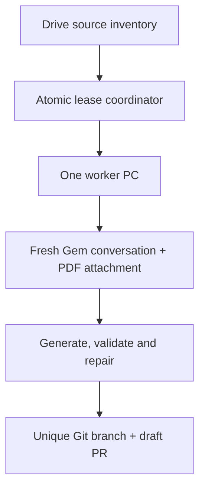

# Automated learning-content generator

This Python 3.12 package turns one controlled Google Drive `source.pdf` into one repository-compatible subchapter draft. It supports a safe first validation run for a named subchapter and a distributed mode in which several Windows PCs claim different PDFs from the same Drive tree.

The generator never adds a source PDF, OAuth credential, browser profile, coordinator token, or Gemini response transcript to Git. Generated content remains `draft` until the repository's qualified human reviews are complete.

## Implemented architecture



- The Gem's Description and Instructions are fixed and initialized only when blank or `to be included`.
- Gem Knowledge is never read, uploaded, modified, or cleaned by the package.
- Every job uses a fresh conversation and attaches exactly one temporary PDF through Selenium.
- Python owns stable IDs, staged generation, strict JSON parsing, deterministic schema/content validation, targeted repair, file writing, tests, Git, and PR creation.
- A central lease prevents two PCs from processing the same Drive file version.
- The PDF is deleted from the local run directory immediately after Gemini confirms the conversation attachment.
- Gemini chat/file retention is controlled by the Google account's Gemini Activity settings; the package does not claim that submitting a file deletes it from Google's service.

## Source identity and job selection

The Drive scanner recursively finds files matching this structure:

```text
.../<subchapter-id>/source.pdf
```

The immediate parent directory must look like `8.1`. All ancestors are project-defined, so paths such as `AnyBook_15_17/15/15.1/source.pdf` work without code changes. Jobs are sorted numerically by chapter and subchapter. A job identity combines the stable Drive file ID with the Drive MD5/version/modified-time value, so replacing a PDF creates a new source version.

The `[run]` values in `config/project.toml` are templates. The generator materializes `{chapter_number}`, `{section_number}`, `{subchapter_id}`, `{section_slug}`, and `{source_id_prefix}` after resolving or claiming a PDF. The project configurator derives `source_id_prefix` from the project name; it can then be edited explicitly in the single project file when a textbook-specific source label is preferred.

Two selection modes are provided:

| Mode | Purpose |
|---|---|
| `specific` | Controlled first run for `pdf_subchapter_path`, such as `8.1`; no central claim is made. |
| `distributed` | Discover all source PDFs and atomically claim the first one that is absent from the local main branch and not queued, leased, under review, or completed elsewhere. |

The current source-manifest schema represents exactly one controlled file, so the generator intentionally processes one PDF per package.

## Multi-PC coordinator

The pilot coordinator consists of a private Google Sheet and the Apps Script in `coordinator/apps-script/Code.gs`. Apps Script `LockService` protects the short claim/update transaction; it does not serialize Gemini generation.

Each request and ledger row carries the configured `project_name`, so one deployed coordinator cannot accidentally accept a worker configured for another project. Each ledger row records:

- Drive file ID and source version;
- subchapter and relative path;
- `queued`, `leased`, `review_pending`, `completed`, or `failed` status;
- worker ID, lease expiry, and heartbeat;
- attempt count, branch, PR URL, and bounded error information.

Workers renew their lease in the background. If a PC stops, its lease eventually expires and a later worker can reclaim the job. A worker that cannot prove ownership stops before commit or push.

Follow `coordinator/apps-script/README.md` to create the private ledger and deploy the coordinator. `initializeCoordinator` generates `WORKER_TOKEN` using Apps Script cryptographic digest utilities and never overwrites an existing token. Keep it in Apps Script Properties and the matching project-derived coordinator environment variable on each PC; never place a token value in TOML or Git.

## Gemini behavior

The fixed Description is in `app_generator/resources/gem_description.txt`; the fixed Instructions are in `app_generator/resources/gem_instructions.md`. Display them with:

```powershell
python -m app_generator show-gem-config
```

At runtime Selenium:

1. opens the configured Gem editor and verifies the expected Google account and Gem name;
2. initializes Description and Instructions only if they are uninitialized placeholders;
3. leaves meaningful manual content and Default tool unchanged;
4. opens a fresh Gem conversation;
5. discovers the models visible to the authenticated account and selects the highest-ranked enabled model;
6. attaches the claimed local PDF to that conversation;
7. submits staged, machine-readable generation and repair prompts.

If Gemini displays a recognized transient service-error response, the generator captures a screenshot in the
external run `diagnostics` directory, closes the failed controlled browser, launches a fresh Gem conversation,
reattaches a verified copy of the same controlled PDF, removes that temporary copy, and retries only the current
uncached stage. `max_gemini_session_restarts` bounds this recovery loop; its default is two relaunches per run.

The browser uses a dedicated persistent Chrome profile. An ordinary user-opened Chrome tab is not adopted. Optional attach mode requires Chrome to have been explicitly launched with remote debugging and a separate non-default profile.

Gemini has no stable public web-UI automation contract. Accessible selectors are centralized in `gemini/selectors.py`, and a live controlled smoke run remains necessary after major Gemini UI changes or model-menu changes.

## Generated artifacts and review status

For a claimed subchapter the package writes:

```text
content/chapter-*/section-*/README.md
content/chapter-*/section-*/learning-design.md
content/chapter-*/section-*/package.json
content/chapter-*/section-*/review-record.md
content/source-manifests/<package-id>.json
```

Files are staged outside the checkout, parsed, validated using the current repository schemas and validator, and then installed atomically. Existing section artifacts are never overwritten.

The package is validated both as a draft and through the stricter review-level 18-activity gate, but it is written with `status: "draft"`. Automated semantic review does not replace physics, instructional, English, Malay, Simplified Chinese, accessibility, and provenance sign-off.

## Git handoff

When `git_publish = true`, the worker:

1. refuses to start with a dirty worktree;
2. fetches the configured remote and fast-forwards the configured base branch;
3. creates a unique `automation/section-...` branch;
4. generates and validates the five artifacts;
5. runs lint, content validation, and the Python test suite;
6. stages only the generated paths and runs `git diff --cached --check`;
7. commits and pushes the feature branch;
8. opens a draft PR with GitHub CLI;
9. marks the coordinator job `review_pending`.

It never pushes directly to `main`, merges the PR, marks content publishable, or deploys GitHub Pages. After the PR has been reviewed and merged, mark the ledger job complete with `coordinator-complete`.

## First controlled run

For a recycled project, preview the five core configuration changes before applying them:

```powershell
python scripts\configure_project.py `
  --project-name "NewPhysicsProject" `
  --source-root-url "https://drive.google.com/open?id=FOLDER_ID" `
  --gem-url "https://gemini.google.com/gem/GEM_ID" `
  --login-name "authorized@example.com" `
  --gem-name "physics content generator"
```

The command prints a unified diff and writes nothing. After review, repeat it with `--apply`; application requires a clean Git worktree and atomically edits only `config/project.toml`. Commit that change on a branch and merge it through a pull request.

From the repository root in PowerShell:

```powershell
py -3.12 -m venv .venv
.\.venv\Scripts\Activate.ps1
python -m pip install --upgrade pip
python -m pip install -e .
.\sync-workstation.cmd
```

Before running, create a Google Cloud **Desktop app** OAuth client with the Drive API enabled. Save its JSON at the `drive_oauth_client_file` path outside the repository. The first Drive authorization opens a browser and stores a read-only token outside Git.

Edit the sole tracked authority, `config/project.toml`, through a reviewed branch and pull request. For a controlled first run, keep:

```toml
selection_mode = "specific"
pdf_subchapter_path = "8.1"
git_publish = false
```

Then run:

```powershell
python -m app_generator doctor --config .\project.local.toml
python -m app_generator run --config .\project.local.toml
```

`doctor` verifies configuration, Drive authorization, PDF discovery/download, checksum, and manifest compatibility. It does not submit the PDF to Gemini. The first `run` initializes the Gem if necessary and exercises the live UI.

## Enable distributed workers

First merge the generator implementation into `main` and deploy the coordinator. On every worker PC:

```powershell
git switch main
git pull --ff-only
.\.venv\Scripts\Activate.ps1
python -m pip install -e .
.\sync-workstation.cmd
$env:BRILLIANT_CONTENT_GENERATOR_COORDINATOR_TOKEN = "your-coordinator-token"
```

Edit `config/project.toml` through a reviewed pull request:

- set the deployed Apps Script `/exec` URL;
- set the local repository and dedicated Chrome-profile paths;
- set the controlled Serway edition, reviewer, and rights note;
- keep the templated chapter/subchapter fields;
- confirm `git_publish = true`.

Validate and claim one job:

```powershell
python -m app_generator doctor --config .\project.local.toml
python -m app_generator run --config .\project.local.toml
```

Start only one process per local checkout. Other PCs may run concurrently from their own clones and Chrome profiles.

After a PR is reviewed and merged:

```powershell
python -m app_generator coordinator-complete `
  --config .\project.local.toml `
  --job-key "<job-key-from-the-ledger>" `
  --pr-url "<merged-pr-url>"
```

## Configuration precedence and secrets

Precedence is:

1. command-line option;
2. `<PROJECT_ENV_PREFIX>_GENERATOR_*` environment variable derived from `project.project_name`;
3. TOML;
4. generic application default.

Project-specific URLs, account assertions, paths, token names, and source metadata have no application defaults; they must come from `config/project.toml` (or a higher-precedence explicit override).

For the default project only, the old `BRILLIANT_GENERATOR_*` override prefix and `BRILLIANT_COORDINATOR_TOKEN` remain readable with deprecation warnings through 31 December 2026. Renamed projects never consume those legacy variables. Run `sync-workstation.cmd` to regenerate `project.local.toml` and migrate to the project-derived names.

Google passwords, MFA values, cookies, OAuth files, the coordinator token, source PDFs, and run directories must remain outside the repository. `login_name` is an account assertion, not an authentication secret.

## Validation

Ordinary tests do not call Drive, Gemini, Apps Script, GitHub, or Chrome. Run:

```powershell
python scripts\lint.py
python scripts\validate_content.py
python -m unittest discover -s tests -v
node --check app\app.js
```

The live Gemini path is intentionally opt-in because it consumes model resources and uploads a controlled source into Gemini Activity. Do not use the live path until the first specific-mode UI validation succeeds.

## Failure handling

- Drive ambiguity, missing PDFs, wrong accounts, blocked downloads, dirty Git state, UI-contract changes, invalid responses, lease loss, or failed validation stop the run.
- Failed distributed jobs return to `queued` until `max_job_attempts` is reached.
- A failed worker never broad-deletes Drive files, Gemini Knowledge, repository files, branches, or coordinator rows.
- If a failure occurs after a branch was pushed, inspect that branch and the ledger before retrying; the generator refuses to silently reuse an existing job branch.
- Gemini upload quotas and Activity storage are external limits. Use bounded retries and the account's Activity controls rather than assuming uploads are immediately removed.
